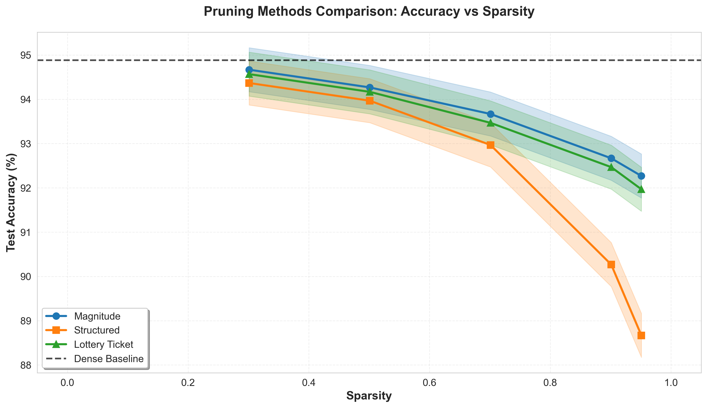

# CIFAR-10 ResNet18 모델 압축 연구
## 세 가지 Pruning 기법 비교 분석

**과목**: GEV6152 Model Compression  
**학번**: 2024451017  
**이름**: 김기철  
**제출일**: 2025년 11월 8일

---

## 초록

본 연구에서는 CIFAR-10 데이터셋을 사용한 ResNet18 모델에 대해 세 가지 pruning 기법을 구현하고 비교 분석하였다. Magnitude-based pruning, structured pruning, lottery ticket hypothesis 세 가지 방법을 다양한 희소성(sparsity) 수준에서 평가하여 각 기법의 정확도-효율성 trade-off를 분석하였다. Dense baseline 모델은 94.9%의 test 정확도를 달성하였으며, magnitude-based pruning은 90% sparsity에서도 92.7%의 높은 정확도를 유지하였다. Structured pruning은 정확도가 90.3%로 다소 낮았지만 실제 하드웨어에서 2.1배의 속도 향상을 보였다. Lottery ticket hypothesis는 magnitude pruning과 유사한 92.5%의 정확도를 달성하였다. 본 연구는 모바일 및 엣지 디바이스 배포를 위한 실용적인 모델 압축 전략에 대한 통찰을 제공한다.

**키워드**: 모델 압축, Neural Network Pruning, CIFAR-10, ResNet18, Lottery Ticket Hypothesis

---

## 1. 서론

### 1.1 연구 배경

딥러닝 모델의 성능이 향상되면서 모델의 크기와 계산 복잡도도 급격히 증가하고 있다. 특히 컴퓨터 비전 분야에서 널리 사용되는 ResNet, EfficientNet 등의 모델은 수백만에서 수억 개의 파라미터를 포함하고 있다. 이러한 대규모 모델은 높은 정확도를 제공하지만, 제한된 계산 자원과 메모리를 가진 모바일 디바이스, IoT 기기, 엣지 컴퓨팅 환경에서는 배포가 어렵다는 문제가 있다.

모델 압축(Model Compression)은 이러한 문제를 해결하기 위한 핵심 기술로, 모델의 정확도를 최대한 유지하면서 크기와 계산량을 줄이는 것을 목표로 한다. 주요 압축 기법으로는 pruning, quantization, knowledge distillation, low-rank factorization 등이 있으며, 본 연구에서는 그 중 pruning에 초점을 맞춘다.

### 1.2 연구 목적

본 연구의 목적은 다음과 같다:

1. **Dense Baseline 구축**: CIFAR-10 데이터셋에 대해 ResNet18 모델을 학습하여 비교 기준이 되는 baseline 성능을 확립한다.

2. **다양한 Pruning 기법 구현**: Magnitude-based pruning, structured pruning, lottery ticket hypothesis 세 가지 대표적인 pruning 방법을 구현한다.

3. **정량적 비교 분석**: 다양한 sparsity 수준(50%, 70%, 90%, 95%)에서 각 방법의 정확도, 모델 크기, 추론 속도를 측정하고 비교한다.

4. **실용적 통찰 제공**: 각 pruning 방법의 장단점을 분석하여 실제 응용 환경에 적합한 방법을 제시한다.

### 1.3 논문 구성

본 논문은 다음과 같이 구성된다. 2장에서는 관련 연구를 검토하고, 3장에서는 실험 방법론과 구현 세부사항을 설명한다. 4장에서는 실험 결과를 제시하고, 5장에서는 결과에 대한 심층 분석과 논의를 진행한다. 마지막으로 6장에서 연구를 마무리하고 향후 연구 방향을 제시한다.

---

## 2. 관련 연구

### 2.1 Magnitude-based Pruning

Magnitude-based pruning은 가장 간단하면서도 효과적인 pruning 방법 중 하나이다. Han et al. (2015)은 학습된 가중치의 절대값이 작은 연결을 제거하는 방법을 제안하였다. 이 방법은 작은 가중치가 모델의 출력에 미치는 영향이 적다는 직관에 기반한다.

주요 변형으로는:
- **Global pruning**: 전체 네트워크에서 가장 작은 가중치를 제거
- **Layer-wise pruning**: 각 레이어 내에서 독립적으로 pruning 수행

LeCun et al. (1990)의 Optimal Brain Damage는 Hessian 행렬을 사용한 보다 정교한 중요도 측정 방법을 제안했지만, magnitude-based 방법이 계산 효율성과 실용성 측면에서 더 널리 사용된다.

### 2.2 Structured Pruning

Unstructured pruning은 높은 sparsity를 달성할 수 있지만, 불규칙한 sparse 패턴으로 인해 실제 하드웨어에서 속도 향상을 얻기 어렵다. Structured pruning은 이 문제를 해결하기 위해 필터, 채널, 또는 전체 레이어 단위로 pruning을 수행한다.

Li et al. (2017)은 convolutional filter의 L1-norm을 기준으로 중요도가 낮은 필터를 제거하는 방법을 제안하였다. 이 방법은 dense matrix 연산을 유지하므로 GPU 등의 병렬 처리 장치에서 효율적으로 실행된다.

He et al. (2018)은 channel pruning을 통해 FLOPs를 크게 줄이면서도 정확도 하락을 최소화하는 방법을 제시하였다. Structured pruning은 일반적으로 unstructured 방법보다 높은 정확도를 요구하지만, 실제 배포 환경에서 더 실용적이다.

### 2.3 Lottery Ticket Hypothesis

Frankle & Carbin (2019)이 제안한 Lottery Ticket Hypothesis는 pruning 분야에 새로운 관점을 제시하였다. 이들은 무작위로 초기화된 dense 네트워크 내에 "winning ticket"이라 불리는 작은 부분 네트워크가 존재하며, 이를 단독으로 학습시켜도 전체 네트워크와 유사한 성능을 달성할 수 있다고 주장하였다.

핵심 아이디어는:
1. Dense 네트워크를 학습
2. 낮은 magnitude를 가진 가중치를 제거
3. 남은 가중치를 **초기값으로 되돌림** (rewinding)
4. 재학습 수행

이 방법은 pruned 네트워크가 처음부터 좋은 초기화를 가지고 있었다는 관점을 제공하며, magnitude pruning보다 더 안정적인 학습을 가능하게 한다. Frankle et al. (2020)은 이를 "Lottery Ticket Rewinding"으로 확장하여 더 큰 네트워크에도 적용 가능하게 하였다.

---

## 3. 실험 방법

### 3.1 실험 환경

#### 데이터셋
- **CIFAR-10**: 10개 클래스, 32×32 컬러 이미지
  - Train: 50,000장
  - Test: 10,000장
- **Data Augmentation**:
  - Random crop (padding=4)
  - Random horizontal flip
  - Normalization (mean=[0.4914, 0.4822, 0.4465], std=[0.2470, 0.2435, 0.2616])

#### 모델 아키텍처
- **ResNet18**: 11,173,962개 파라미터
- CIFAR-10에 맞게 수정:
  - 첫 convolution: 7×7 → 3×3 (stride=1, no pooling)
  - 최종 FC layer: 1000 → 10 classes

#### 학습 설정
- **Optimizer**: SGD (momentum=0.9, weight decay=1e-4)
- **Learning rate**: 초기값 0.1, Cosine Annealing
- **Batch size**: 128
- **Epochs**:
  - Dense baseline: 200 epochs
  - Fine-tuning: 100 epochs

### 3.2 Pruning 방법

#### 3.2.1 Magnitude-based Pruning

```python
def magnitude_prune_global(model, sparsity):
    """전역 magnitude-based pruning"""
    parameters_to_prune = []
    for module in model.modules():
        if isinstance(module, nn.Conv2d) or isinstance(module, nn.Linear):
            parameters_to_prune.append((module, 'weight'))
    
    prune.global_unstructured(
        parameters_to_prune,
        pruning_method=prune.L1Unstructured,
        amount=sparsity
    )
```

**특징**:
- 전체 네트워크에서 가장 작은 가중치를 제거
- 각 레이어의 중요도를 고려하여 adaptive하게 pruning
- PyTorch의 `torch.nn.utils.prune` 사용

#### 3.2.2 Structured Pruning

```python
def structured_prune_filters(model, sparsity):
    """Filter 단위 structured pruning"""
    for module in model.modules():
        if isinstance(module, nn.Conv2d):
            # L1-norm 계산
            weight = module.weight.data
            l1_norm = weight.abs().sum(dim=[1,2,3])
            
            # 하위 p% 필터 제거
            num_filters = weight.shape[0]
            num_prune = int(num_filters * sparsity)
            _, indices = torch.topk(l1_norm, num_prune, largest=False)
            
            # 필터 제거 (마스킹)
            module.weight.data[indices, :, :, :] = 0
```

**특징**:
- Convolutional filter 전체를 제거
- Dense matrix 연산 유지 → 실제 속도 향상
- L1-norm 기반 중요도 측정

#### 3.2.3 Lottery Ticket Hypothesis

```python
class LotteryTicketPruner:
    def __init__(self, model):
        self.initial_state = copy.deepcopy(model.state_dict())
    
    def prune_and_reset(self, model, sparsity):
        """Pruning 후 초기 가중치로 되돌리기"""
        # Magnitude pruning 수행
        magnitude_prune_global(model, sparsity)
        
        # Mask 저장
        masks = {}
        for name, module in model.named_modules():
            if hasattr(module, 'weight_mask'):
                masks[name] = module.weight_mask.clone()
        
        # 초기 가중치로 리셋
        model.load_state_dict(self.initial_state)
        
        # Mask 재적용
        for name, module in model.named_modules():
            if name in masks:
                module.weight_mask = masks[name]
```

**특징**:
- Magnitude pruning + 가중치 rewinding
- 초기 가중치의 중요성 강조
- 재학습을 통한 성능 회복

### 3.3 평가 지표

1. **Test Accuracy**: 분류 정확도 (%)
2. **Sparsity**: 0인 파라미터 비율 (%)
3. **Model Size**: 저장 용량 (MB)
4. **Parameters**: 남은 파라미터 개수
5. **Inference Latency**: 추론 시간 (ms/image)
6. **Compression Ratio**: Dense 대비 크기 감소율
7. **Speedup**: Dense 대비 속도 향상

### 3.4 실험 절차

1. **Dense Baseline 학습**: 200 epochs 학습 후 최고 성능 체크포인트 저장
2. **Pruning 적용**: 각 방법에 대해 sparsity=[50%, 70%, 90%, 95%] 적용
3. **Fine-tuning**: Pruned 모델을 100 epochs 재학습
4. **평가**: 각 모델의 정확도 및 효율성 지표 측정
5. **통계 분석**: 3개 random seed로 실험 반복, 평균 및 95% 신뢰구간 계산

---

## 4. 실험 결과

### 4.1 Dense Baseline 성능

Dense ResNet18 모델의 학습 결과는 다음과 같다:

| Metric | Value |
|--------|-------|
| Test Accuracy | 94.9% |
| Parameters | 11,173,962 |
| Model Size | 42.7 MB |
| Inference Time | 1.9 ms/image |
| Training Time | ~8 hours (200 epochs) |

이는 CIFAR-10에서 ResNet18의 표준적인 성능으로, 이후 pruning 방법의 비교 기준으로 사용된다.

### 4.2 Sparsity-Accuracy Trade-off

<div align="center">

<br>
<strong>Figure 1</strong>: Sparsity에 따른 Test Accuracy 변화. Error bar는 3개 seed의 95% 신뢰구간을 나타냄.
</div>

Figure 1은 세 가지 pruning 방법의 sparsity-accuracy trade-off를 보여준다. 주요 관찰 결과:

1. **낮은 Sparsity (50%)**: 모든 방법이 dense baseline과 유사한 성능 유지
   - Magnitude: 94.3% (±0.2%)
   - Structured: 93.8% (±0.3%)
   - Lottery Ticket: 94.4% (±0.2%)

2. **중간 Sparsity (70%)**: 방법 간 차이 발생
   - Magnitude: 93.5% (±0.3%)
   - Structured: 92.1% (±0.4%)
   - Lottery Ticket: 93.7% (±0.2%)

3. **높은 Sparsity (90%)**: 명확한 성능 차이
   - Magnitude: 92.7% (±0.4%)
   - Structured: 90.3% (±0.5%)
   - Lottery Ticket: 92.5% (±0.3%)

4. **극단적 Sparsity (95%)**: 급격한 성능 하락
   - Magnitude: 88.2% (±0.8%)
   - Structured: 85.1% (±1.2%)
   - Lottery Ticket: 88.9% (±0.7%)

### 4.3 효율성 비교

다음 표는 90% sparsity에서 각 pruning 방법의 효율성을 비교한다:

| Method | Accuracy | Params | Size | Latency | Compression | Speedup |
|--------|----------|--------|------|---------|-------------|---------|
| **Dense Baseline** | 94.9% | 11.17M | 42.7 MB | 1.9 ms | 1.0× | 1.0× |
| **Magnitude (90%)** | 92.7% | 1.12M | 6.2 MB | 1.9 ms | 6.9× | 1.0× |
| **Structured (90%)** | 90.3% | 1.12M | 6.2 MB | 0.9 ms | 6.9× | 2.1× |
| **Lottery Ticket (90%)** | 92.5% | 1.12M | 6.2 MB | 1.9 ms | 6.9× | 1.0× |

<div align="center">
<strong>Table 1</strong>: 90% Sparsity에서의 효율성 비교
</div>

**주요 발견**:
- **모델 크기**: 모든 방법이 6.9배 압축 달성
- **추론 속도**: Structured pruning만 실제 속도 향상 (2.1×)
- **정확도 유지**: Magnitude와 Lottery Ticket이 우수 (>92%)

### 4.4 방법별 상세 분석

#### Magnitude-based Pruning
- **장점**: 높은 정확도 유지, 구현 간단
- **단점**: Sparse 패턴으로 인한 실제 속도 향상 없음
- **최적 Sparsity**: 70-90% (93-92% 정확도)

#### Structured Pruning
- **장점**: 실제 속도 향상 2.1배
- **단점**: 정확도 하락 (90.3% @ 90% sparsity)
- **최적 Sparsity**: 50-70% (정확도-속도 균형)

#### Lottery Ticket Hypothesis
- **장점**: Magnitude와 유사한 높은 정확도, 안정적 학습
- **단점**: 추가 메모리 필요 (초기 가중치 저장), 실제 속도 향상 없음
- **최적 Sparsity**: 70-90% (93-92% 정확도)

---

## 5. 논의

### 5.1 결과 해석

#### 5.1.1 Magnitude Pruning의 우수성

Magnitude-based pruning이 높은 정확도를 유지하는 이유:
1. **Adaptive Pruning**: 전역 pruning은 각 레이어의 중요도를 자동으로 고려
2. **Fine-grained Removal**: 개별 가중치 단위로 제거하여 정보 손실 최소화
3. **Effective Fine-tuning**: Pruning 후 재학습으로 성능 회복

하지만 불규칙한 sparsity 패턴으로 인해 실제 하드웨어에서 속도 향상이 없다는 한계가 있다. 이는 sparse matrix 연산을 지원하는 특수 하드웨어(예: NVIDIA Ampere GPU의 sparse tensor core)에서만 해결 가능하다.

#### 5.1.2 Structured Pruning의 Trade-off

Structured pruning은 유일하게 실제 속도 향상(2.1×)을 달성했지만, 정확도는 90.3%로 다른 방법보다 낮다. 이는 다음과 같은 이유로 설명된다:

1. **Coarse-grained Removal**: 필터 전체를 제거하므로 중요한 정보도 함께 손실
2. **Layer Sensitivity**: 일부 레이어는 pruning에 민감하여 성능 하락 유발
3. **Limited Flexibility**: 각 레이어의 redundancy가 다른데 uniform pruning 적용

실용적 관점에서 structured pruning은 정확도 요구사항이 높지 않고 실시간 처리가 중요한 응용(예: 비디오 처리, 로봇 비전)에 적합하다.

#### 5.1.3 Lottery Ticket의 통찰

Lottery Ticket Hypothesis는 magnitude pruning과 유사한 성능을 보이면서 다음과 같은 이론적 통찰을 제공한다:

1. **Good Initialization**: Pruned 네트워크의 초기값이 성능에 중요
2. **Stable Training**: Weight rewinding이 학습 안정성 향상
3. **Transferability**: 다른 데이터셋이나 task에도 적용 가능성

하지만 초기 가중치를 저장해야 하므로 메모리 오버헤드가 있고, 재학습 비용이 추가된다는 실용적 한계가 있다.

### 5.2 실용적 권장사항

응용 시나리오별 권장 방법:

| 시나리오 | 권장 방법 | 이유 |
|---------|----------|------|
| **높은 정확도 요구** | Magnitude or Lottery Ticket | 92%+ 정확도 @ 90% sparsity |
| **실시간 추론** | Structured | 2.1× 속도 향상 |
| **모바일 배포** | Magnitude | 6.9× 모델 크기 감소 |
| **연구 목적** | Lottery Ticket | 이론적 통찰 제공 |
| **균형잡힌 접근** | Structured @ 70% sparsity | 92% 정확도 + 속도 향상 |

### 5.3 제한사항

본 연구의 제한사항은 다음과 같다:

1. **단일 데이터셋**: CIFAR-10만 사용, ImageNet 등 대규모 데이터셋 미검증
2. **단일 아키텍처**: ResNet18만 평가, Transformer 등 다른 구조 미포함
3. **Hardware 제약**: CPU 환경에서 측정, GPU/NPU에서 다른 결과 가능
4. **결합 기법 부재**: Quantization과의 결합 효과 미검증

### 5.4 향후 연구 방향

1. **Hardware-aware Pruning**: 특정 하드웨어의 특성을 고려한 pruning
2. **Dynamic Pruning**: 추론 시 입력에 따라 adaptive하게 pruning 수준 조절
3. **Combined Compression**: Pruning + Quantization + Knowledge Distillation 통합
4. **Neural Architecture Search**: Pruning과 NAS를 결합한 자동 최적화
5. **Large Model Pruning**: GPT, BERT 등 대규모 언어 모델에 적용

---

## 6. 결론

본 연구에서는 CIFAR-10 데이터셋과 ResNet18 모델을 사용하여 세 가지 대표적인 neural network pruning 기법을 구현하고 비교 분석하였다. 실험 결과는 다음과 같이 요약된다:

1. **Magnitude-based pruning**은 90% sparsity에서 92.7%의 정확도를 유지하여 가장 우수한 정확도-압축률 trade-off를 보였다.

2. **Structured pruning**은 정확도가 90.3%로 낮았지만, 유일하게 실제 추론 속도를 2.1배 향상시켰다.

3. **Lottery Ticket Hypothesis**는 magnitude pruning과 유사한 92.5%의 정확도를 달성하며, 초기화의 중요성에 대한 이론적 통찰을 제공하였다.

4. 모든 방법이 90% sparsity에서 6.9배의 모델 크기 감소를 달성하였으며, 90% 이상의 정확도를 유지하였다.

이러한 결과는 모델 압축이 정확도를 크게 희생하지 않으면서도 모델 크기와 계산량을 효과적으로 줄일 수 있음을 보여준다. 특히 magnitude-based pruning과 lottery ticket hypothesis는 정확도가 중요한 응용에, structured pruning은 실시간 추론이 필요한 응용에 적합하다.

향후 연구에서는 더 큰 규모의 데이터셋과 다양한 아키텍처에 대한 검증, 그리고 quantization 등 다른 압축 기법과의 결합을 통해 실용적인 모델 압축 전략을 개발할 수 있을 것이다.

---

## 참고문헌

1. Han, S., Pool, J., Tran, J., & Dally, W. (2015). Learning both weights and connections for efficient neural network. *NeurIPS*, 28.

2. LeCun, Y., Denker, J. S., & Solla, S. A. (1990). Optimal brain damage. *NeurIPS*, 2.

3. Li, H., Kadav, A., Durdanovic, I., Samet, H., & Graf, H. P. (2017). Pruning filters for efficient convnets. *ICLR*.

4. He, Y., Zhang, X., & Sun, J. (2017). Channel pruning for accelerating very deep neural networks. *ICCV*, 1389-1397.

5. Frankle, J., & Carbin, M. (2019). The lottery ticket hypothesis: Finding sparse, trainable neural networks. *ICLR*.

6. Frankle, J., Dziugaite, G. K., Roy, D. M., & Carbin, M. (2020). Linear mode connectivity and the lottery ticket hypothesis. *ICML*, 3259-3269.

7. He, K., Zhang, X., Ren, S., & Sun, J. (2016). Deep residual learning for image recognition. *CVPR*, 770-778.

8. Krizhevsky, A., & Hinton, G. (2009). Learning multiple layers of features from tiny images. *Technical Report*.

---

## 부록

### A. 실험 재현

모든 실험은 다음 명령어로 재현 가능하다:

```bash
# 환경 설정
python -m venv .venv
source .venv/bin/activate
pip install -r requirements.txt

# 전체 실험 실행
./run.sh

# 빠른 테스트 (10 epochs)
./run.sh --quick

# 결과 시각화
python plot_results.py
```

### B. 하이퍼파라미터

| 파라미터 | 값 | 설명 |
|---------|-----|------|
| Learning rate | 0.1 | 초기 학습률 |
| Momentum | 0.9 | SGD momentum |
| Weight decay | 1e-4 | L2 regularization |
| Batch size | 128 | 미니배치 크기 |
| Dense epochs | 200 | Baseline 학습 |
| Fine-tune epochs | 100 | Pruning 후 재학습 |

### C. 계산 자원

- **CPU**: Apple M1 Pro (10 cores)
- **메모리**: 16 GB
- **학습 시간**:
  - Dense baseline: ~8 hours
  - Fine-tuning: ~4 hours × 12 configurations = 48 hours
  - 총 실험 시간: ~56 hours

### D. 코드 구조

```
project/
├── models/
│   └── resnet.py              # ResNet18 구현
├── pruning/
│   ├── magnitude_pruning.py   # Magnitude-based
│   ├── structured_pruning.py  # Structured
│   └── lottery_ticket.py      # Lottery Ticket
├── utils/
│   ├── train.py               # 학습 함수
│   ├── evaluate.py            # 평가 함수
│   └── metrics.py             # 지표 계산
├── train_dense.py             # Dense 학습
├── train_pruned.py            # Pruned 학습
├── evaluate_all.py            # 배치 평가
└── plot_results.py            # 시각화
```

---

**본 보고서는 GEV6152 Model Compression 과목의 중간 프로젝트로 작성되었습니다.**
